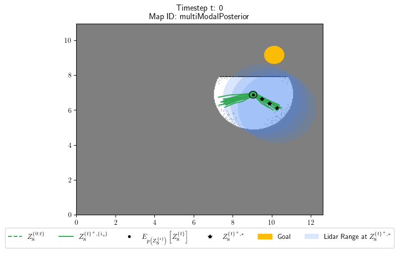

# Welcome to the ProbMind project

The goal of this project is to develope a series of generally applicable and reuseable code fragments of probabilistic programs, what we refer to as probabilistic idioms, for use in cognitive robotics. For an extensive introduction to the background behind this project please consult
```
@misc{damgaard2021idiomatic,
      title={Toward an Idiomatic Framework for Cognitive Robotics}, 
      author={Malte R. Damgaard and Rasmus Pedersen and Thomas Bak},
      year={2021},
      eprint={2111.13027},
      archivePrefix={arXiv},
      primaryClass={cs.RO}
}
```
If you like this work or use in your scientific projects, please use the reference above.

To try out the code install the project dependencies, and run any of the example scripts via the code in their respective README's. The current dependencies of the project can be installed as a conda environment via the command:
```
$ conda env create -f probmind/conda_environment_cross_platform.yml
```

## Collaboration/Contributions
If you would like to collaborate on this project or anything related, or make contributions to the project, feel free to reach out to [Malte R. Damgaard](https://vbn.aau.dk/da/persons/134312) prefeerable via [email](mailto:mrd@es.aau.dk?subject=[GitHub]%20The%20ProbMind%20Project)

## Background
For a long time it has been recognized that a hybrid symbolic-subsymbolic approach is probably the best for developing systems with general intelligent autonomous behavior. Until now, incorporation of sub-symbolic probabilistic processing have been limited due to the availeable inference algorithms and the computational cost associated with these. Therefore, often problem specific code optimizations have been necessary to obtain computationally tractable systems. However, with the latest advancements in probabilistic programming, such probabilistic processing have become way more tractable and flexible. As a result, this project seeks to implement generally applicable and reuseable code fragments of probabilistic programs for use in cognitive robotics. In order to do this, this project is built around the probabilistic programming language [Pyro](https://pyro.ai/).

## cognition
This module is supposed to contain the implementations of the reuseable probabilistic idioms. Currently, it only contains the "Planning" idiom, which can be used to reason about future optimal actions.

## Examples
This module contains a series of projects incorporating the general probabilistic idioms into problem specific use-cases. 

### robotPlanning


This set of simulations illustrates different usecases of the planning idiom. The simulations utilizes the [HouseExpo](https://github.com/TeaganLi/HouseExpo) dataset and a modified version of their simulator, to generate realistic SLAM output in the form of a map and estimated position. Currently, 3 different simulation scenarios have been implemented:

- [Exploration](https://github.com/damgaardmr/probMind/blob/main/examples/robotPlanning/docs/README.md#exploration)
- [Goal Search](https://github.com/damgaardmr/probMind/blob/main/examples/robotPlanning/docs/README.md#goal-search)
- [Planning with Multimodal Action Posterior](https://github.com/damgaardmr/probMind/blob/main/examples/robotPlanning/docs/README.md#planning-with-multimodal-action-posterior)

For more information consult the simulation [README](../examples/robotPlanning/docs/README.md)

## TODO/NEW IDEAS/Future Work
- [X] how to detect when an impasse occurs?
- [ ] General optimization of code
- [ ] implement constraint between states, i.e. between z_s_tau and z_s_tauMinus1
- [ ] Introduce memorable states - i.e. states where we had multiple choices - this would also require the implementation of sub-goals
- [ ] Implement hierarchical or parallel decisions/planning with intertwined subgoals and shared states, constraints, PB, etc. - via msg-passing algorithms?
- [ ] Attention mechanism to direct sampling - i.e. we should consider more samples in the direction of the action
- [ ] Add uncertainty to LTM variables that have not been updated for a long time? coresponding to loss of memory
- [ ] consider a Geometric distribution as prior (i.e. in the model) over number of options (K) - many times there only exist 1 option, but sometimes we have an unknown number of options (at least at compile time)
- [ ] consider a Geometric distribution as prior (i.e. in the model) over number of planning timesteps (T) - often it is sufficient to only plan a few time steps into the future (fast inference), e.g. when exploring, however, sometimes it would be advantageous to plan further into the future (high "T" mean slower inference), e.g. when planning to reach a specific state.
- [ ] consider implementing rejection sampling for Hard constraints?
- [ ] introduce a baseline when using goals
- [ ] Validate performance on physical robots