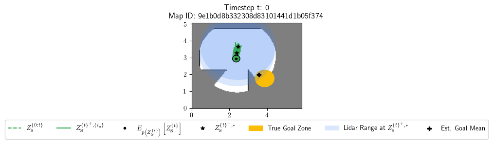
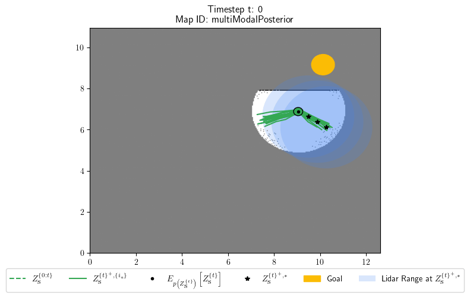

# robotPlanning
This set of simulations illustrates different usecases of the "Planning" idiom. The simulations utilizes the [HouseExpo](https://github.com/TeaganLi/HouseExpo) dataset and a modified version of their simulator, to generate realistic SLAM output in the form of a map and estimated position.

Before trying any of running any of the simulations remember to unpack files in the HouseExpo simulator as stated in the modules [README](../../misc/HouseExpo/README.md), e.g. by running the command:
```
tar -xvzf probMind/examples/misc/HouseExpo/HouseExpo/json.tar.gz
```

## Exploration


This simulation examplifies pure exploration by utilizing the "Planning" idiom. The goal of the robot is to explore its environment, i.e., determine the state of all cells in a gridmap. The config for this simulation can be found in 
```
probmind/examples/robotPlanning/configs/damgaard22Exploration
```
and the simulation can be started via the command:
```
$ cd probmind/examples/robotPlanning
$ conda activate probMind_env_cross_platform
$ python __main__.py -config_file "configs/damgaard22Exploration"
```
For more information we refer you to our publication:
```
@unpublished{damgaard2021AKS,
      title={A Probabilistic Programming Idiom for Active Knowledge Search}, 
      author={Malte R. Damgaard and Rasmus Pedersen and Thomas Bak},
      year={2022},
      note={Submitted}
}
```
If you like this work or use in your scientific projects, please use the reference above.

## Goal Search


This simulation examplifies how the "Planning" idiom can be used to find goals in an environment. The simulation builds upon the pure "Exploration" example, by implementing a fallback to exploration whenever the goal is not in sight. Futhermore, this simulation also illustrates reflection about impasse. The config for this simulation can be found in 
```
probmind/examples/robotPlanning/configs/damgaard22GoalSearch
```
and the simulation can be started via the command:
```
$ cd probmind/examples/robotPlanning
$ conda activate probMind_env_cross_platform
$ python __main__.py -config_file "configs/damgaard22GoalSearch"
```
For more information we refer you to our publication:
```
@unpublished{damgaard2021GS,
      title={A Probabilistic Programming Idiom for Goal Search},  
      author={Malte R. Damgaard and Rasmus Pedersen and Thomas Bak},
      year={2022},
      note={Being documented}
}
```
If you like this work or use in your scientific projects, please use the reference above.


## Planning with Multimodal Action Posterior


In environments with highly non-convex representations it is often the case that there exist more than one good plan for the future. This simulation illustrates the use of a multimodal action posterior to represent such ambiguities of the best plan for the future. The simulation builds upon the "Goal Search" example.
The config for this simulation can be found in 
```
probmind/examples/robotPlanning/configs/damgaard22MultiModalActionPosterior
```
and the simulation can be started via the command:
```
$ cd probmind/examples/robotPlanning
$ conda activate probMind_env_cross_platform
$ python __main__.py -config_file "configs/damgaard22MultiModalActionPosterior"
```
For more information we refer you to our publication:
```
@unpublished{damgaard2021MAP,
      title={A Probabilistic Programming Idiom for Planning with Multimodal Action Posterior},  
      author={Malte R. Damgaard and Rasmus Pedersen and Thomas Bak},
      year={2022},
      note={Being documented}
}
```
If you like this work or use in your scientific projects, please use the reference above.

## TODO
The following is a list of things that could potentially be improved:
- [ ] implement rotation and FOV in lidar model
- [ ] Change state to a dict - e.g. z_s_tau["position"]
- [ ] consider noise on state in the simulator